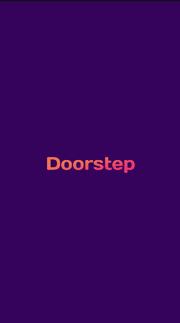
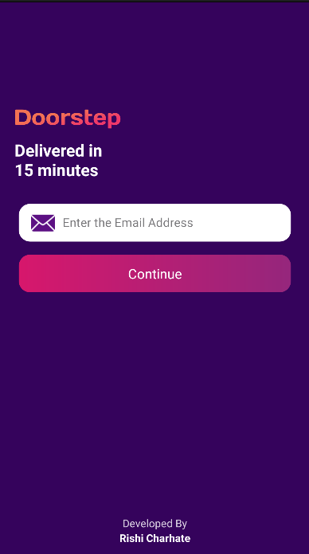
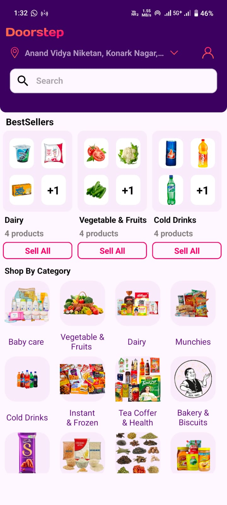
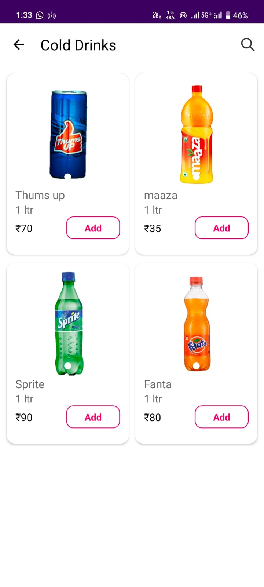
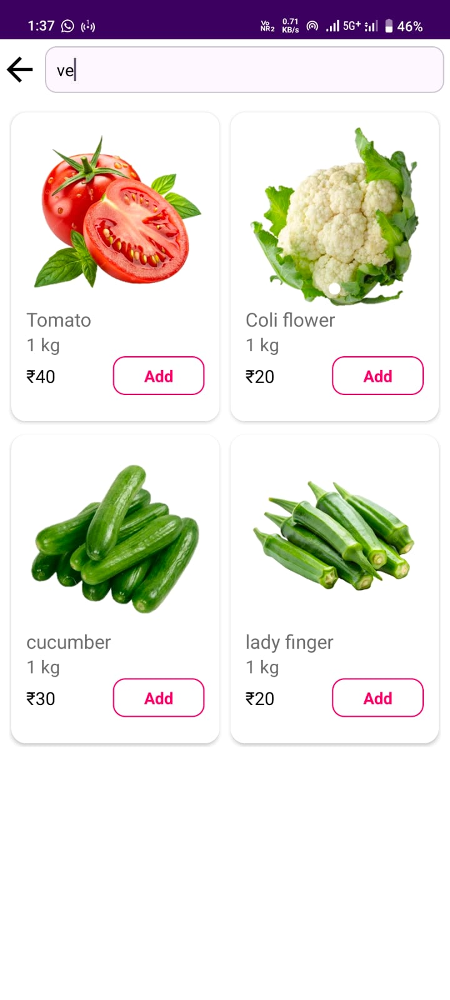
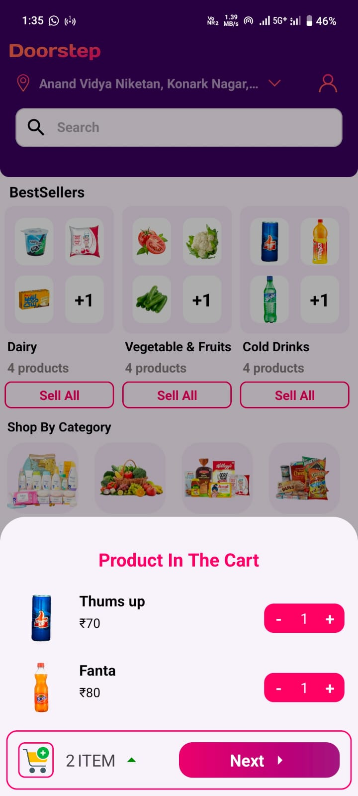
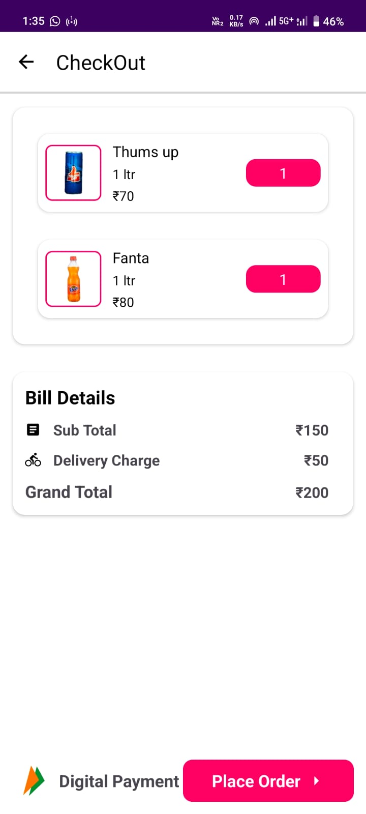
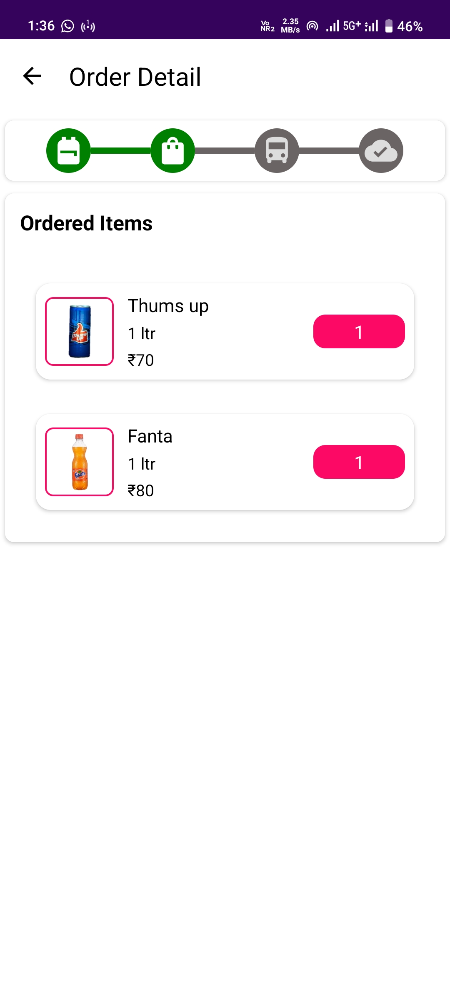
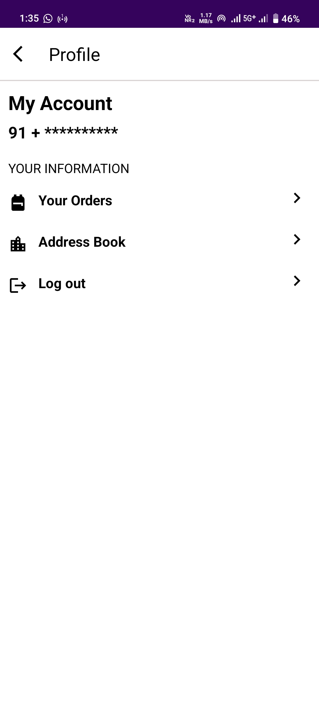

# 🛒 Doorstep Ecosystem

Doorstep is a complete Quick-Commerce solution consisting of two separate Android applications:

| Application           | Description                                          |
| --------------------- | ---------------------------------------------------- |
| 📱 Doorstep User App  | Customer-facing grocery shopping application         |
| 🏪 Doorstep Admin App | Product, inventory, and order management application |

## Repositories

* 📱 User App: https://github.com/Rishicharhate/Doorstep-user-app
* 🏪 Admin App: https://github.com/Rishicharhate/Doorstep-Admin_App

---

# 🛒 Doorstep - Quick Commerce Android App

<p align="center">
  
</p>

<p align="center">
  <b>Doorstep</b> is a modern Quick-Commerce Android application designed to provide a seamless grocery shopping experience. Users can browse products, search items instantly, manage a persistent cart, place orders, track deliveries, and manage delivery addresses through a clean and intuitive user interface.
</p>

<p align="center">
  
  
  
  
  
</p>

---

# 📱 Application Screenshots

## Authentication & Onboarding

| Splash Screen                                  | Login Screen                                  |
| ---------------------------------------------- | --------------------------------------------- |
|  |  |

## Shopping Experience

| Home Screen                                  | Product Details                                         | Search                                         |
| -------------------------------------------- | ------------------------------------------------------- | ---------------------------------------------- |
|  |  |  |

## Cart & Orders

| Cart                                         | Checkout                                         | Orders                                         |
| -------------------------------------------- | ------------------------------------------------ | ---------------------------------------------- |
|  |  |  |

## Profile

| Profile                                         |
| ----------------------------------------------- |
|  |

---

# ✨ Features

## 🔐 Authentication

* Email OTP Authentication using Supabase Auth.
* Guest Login support for testing.
* Secure session management.
* Persistent user login.

## 🛍 Product Browsing

* Browse products by categories.
* Best Seller product section.
* Product image slideshow.
* Product detail page.
* Dynamic product listing from Supabase.

## 🔍 Smart Search

* Instant search functionality.
* Search by:

  * Product Name
  * Category
  * Price
  * Quantity

## 🛒 Persistent Cart

* Built using Room Database.
* Cart remains saved after app restarts.
* Quantity management.
* Real-time total calculation.

## 💳 Checkout System

* Automatic delivery charge calculation.
* Order summary page.
* Smooth checkout flow.

## 📦 Order Management

* Place orders directly from cart.
* View order history.
* Live order status updates:

  * Placed
  * Packed
  * Shipped
  * Delivered

## 👤 Profile & Address Book

* Save delivery addresses.
* Update address anytime.
* Data synced with Supabase.
* User profile management.

## ⚡ Modern User Experience

* Material Design 3.
* Facebook Shimmer Loading Effects.
* Smooth Navigation Component transitions.
* Responsive layouts.
* Fast image loading using Coil.

---

# 🏗 Architecture

The application follows the MVVM architecture pattern combined with Clean Architecture principles.

```text
Presentation Layer
│
├── Activities
├── Fragments
├── RecyclerView Adapters
└── ViewModels

Domain Layer
│
├── Repository Interfaces
└── Business Logic

Data Layer
│
├── Supabase
├── Room Database
├── Repository Implementations
└── Models
```

---

# 🛠 Tech Stack

| Category          | Technology                |
| ----------------- | ------------------------- |
| Language          | Kotlin                    |
| Architecture      | MVVM + Clean Architecture |
| Backend           | Supabase                  |
| Authentication    | Supabase Auth             |
| Database          | PostgreSQL                |
| Local Storage     | Room Database             |
| Async Programming | Kotlin Coroutines & Flow  |
| UI Components     | Material Design 3         |
| Navigation        | Navigation Component      |
| Image Loading     | Coil                      |
| Product Gallery   | Image Slider              |
| View Binding      | ViewBinding               |
| Loading Effects   | Facebook Shimmer          |

---

# ⚙️ Supabase Setup

## 1️⃣ Create Supabase Project

Create a project from:

https://supabase.com

Retrieve:

* Project URL
* Public (Anon) API Key

---

## 2️⃣ Configure Authentication

Navigate to:

```text
Authentication → Providers
```

Enable:

* Email Authentication

(Optional)

Disable:

```text
Confirm Email
```

for easier OTP testing.

---

## 3️⃣ Create Database Tables

Run the following SQL schema in the Supabase SQL Editor.

```sql
-- Profiles Table
CREATE TABLE profiles (
  id uuid PRIMARY KEY REFERENCES auth.users ON DELETE CASCADE,
  address TEXT
);

-- Products Table
CREATE TABLE admin (
  id uuid DEFAULT gen_random_uuid() PRIMARY KEY,
  productTitle TEXT,
  productCategory TEXT,
  productPrice INT,
  productQuantity INT,
  productUnit TEXT,
  productStock INT,
  productImagesUris TEXT[],
  created_at TIMESTAMP WITH TIME ZONE DEFAULT NOW()
);

-- Orders Table
CREATE TABLE orders (
  id bigint GENERATED BY DEFAULT AS IDENTITY PRIMARY KEY,
  user_id uuid REFERENCES auth.users,
  total_amount INT,
  status TEXT DEFAULT 'Placed',
  date DATE DEFAULT CURRENT_DATE,
  created_at TIMESTAMP WITH TIME ZONE DEFAULT NOW()
);

-- Order Items Table
CREATE TABLE order_items (
  id bigint GENERATED BY DEFAULT AS IDENTITY PRIMARY KEY,
  order_id bigint REFERENCES orders(id) ON DELETE CASCADE,
  product_id uuid REFERENCES admin(id),
  item_quantity INT,
  price INT
);
```

---

## 4️⃣ Configure Supabase Client

Open:

```text
SupabaseClient.kt
```

Replace with your credentials:

```kotlin
val client = createSupabaseClient(
    supabaseUrl = "YOUR_SUPABASE_URL",
    supabaseKey = "YOUR_SUPABASE_ANON_KEY"
) {
    install(Auth)
    install(Postgrest)
}
```

---

# 🚀 Getting Started

## Clone Repository

```bash
git clone https://github.com/Rishicharhate/Doorstep-user-app.git
```

## Open Project

Open using:

```text
Android Studio Hedgehog or newer
```

## Sync Dependencies

Allow Gradle to download all dependencies.

## Configure Backend

* Create Supabase Project
* Create Tables
* Add API Keys
* Add Sample Products

## Run App

```bash
Shift + F10
```

or click the Run button in Android Studio.

---

# 📁 Project Structure

```text
app/
│
├── activity/
│   ├── AuthMainActivity
│   ├── UserMainActivity
│   └── OrderPlacedActivity
│
├── fragments/
│   ├── HomeFragment
│   ├── SearchFragment
│   ├── CartFragment
│   ├── CategoryFragment
│   ├── ProfileFragment
│   └── OrdersFragment
│
├── adapters/
├── viewmodels/
├── repository/
├── room/
├── models/
├── utils/
└── SupabaseClient.kt
```

---

# 🏪 Admin Application

The Doorstep ecosystem also includes a dedicated Admin Application.

### Admin Features

* Add Products
* Edit Products
* Delete Products
* Manage Inventory
* Update Order Status
* Upload Product Images
* Manage Product Categories

### Admin Repository

```text
https://github.com/Rishicharhate/Doorstep-Admin-App
```

# 🔮 Future Enhancements

* Razorpay Payment Gateway
* Push Notifications
* Coupons & Discounts
* Wishlist
* Product Reviews & Ratings
* Dark Mode
* Live Delivery Tracking
* AI Product Recommendations

---

# 👨‍💻 Developer

### Rishi Charhate

Android Developer • AI/ML Enthusiast • Full Stack Learner

#### Areas of Interest

* Android Development
* Artificial Intelligence
* Machine Learning
* Cybersecurity
* Backend Development

---

# ⭐ Support

If you found this project helpful, please consider giving it a ⭐ on GitHub.

Your support motivates future improvements and new features.

---

## License

This project is licensed under the MIT License.
